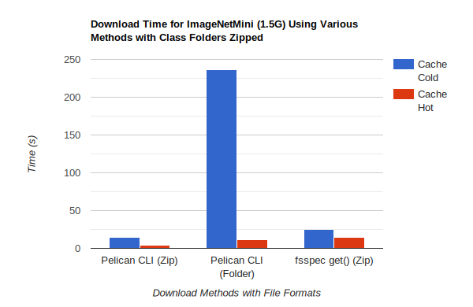
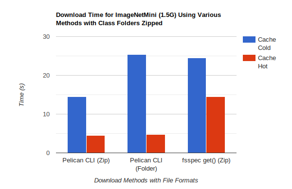

# Using PyTorch with Pelican

This tutorial guides you through setting up and using PyTorch with Pelican for efficient data management and processing.

There will be quite a lot of Pelican terms used. A reference for these core terms cane be found [here](https://docs.pelicanplatform.org/core-concepts)

## 1. Install Pelican and PyTorch

Ensure that both Pelican and PyTorch are installed on your system.


For Pelican installation instructions, go [here](https://docs.pelicanplatform.org/install)

For PyTorch installation intstructions, go [here](https://pytorch.org/get-started/locally/).

### Verification

For macOS and Linux, run the following command to verify your Pelican installation:

```shell
which pelican

Use the following command to start your first Pelican operation:

$ pelican object get pelican://osg-htc.org/chtc/PUBLIC/hzhao292/test.txt test.txt
$ cat test.txt
```

#### Expected output:

```shell
Hello, World!
```


For details of Pelican Installation, see [here](https://docs.pelicanplatform.org/install)

For pytorch installation, see [here](https://pytorch.org/get-started/locally/).


## 2. Accessing Pelican's data

### 2.1: Using command line to download data

Before downloading your data, you should have know your target's federation and namespace prefix. 

Use the `object get` command to download your data to a local destination. Below is the format to follow. For more details, read the [Pelican Client Guide]((https://docs.pelicanplatform.org/getting-data-with-pelican/client)).

```shell
pelican object get pelican://<federation-url></namespace-prefix></path/to/file> <local/path/to/file>
```

An example for you to try out:

```shell
pelican object get pelican://osg-htc.org/chtc/PUBLIC/hzhao292/ImageNetMini.tgz ImageNetMini.tgz
```

You should see a progress bar output and eventually a file named `ImageNetMini.tgz` within your local directory:

```shell
$ pelican object get pelican://osg-htc.org/chtc/PUBLIC/hzhao292/ImageNetMini.tgz ImageNetMini.tgz 
ImageNetMini.tgz 1.34 GiB / 1.45 GiB [========================>--] 0s ] 0.00 b/s

```


If the target object is a directory, you can download the whole directory with anything in it using **--recursive** flag.

 ```pelican object get pelican://osg-htc.org/chtc/PUBLIC/hzhao292/ImageNetMini --recursive ImageNetMini```


### 2.2: Using pelicanfs(fsspec) to access/download data

Using the command line is simple, but you may want to do some more complicated operations or want to integrate python code which already uses and fsspec for ease of use and consistency. To accomplish this, use the `pelicanfs` API, which is an implementation of [`fsspec`](https://filesystem-spec.readthedocs.io/en/latest/index.html). `fsspec` exists to provide a familiar API that will work the same whatever the storage backend. (For more detailed information,  please read [fsspec's document](https://filesystem-spec.readthedocs.io/en/latest/index.html))

To install pelicanfs, run:

```shell
pip install pelicanfs
```

#### 2.2.1: Use fsspec with the osdf protocol

If your data is on the osdf. You can also use the osdf protocol which is a specific version of the pelican protocol with the osdf's federation discovery url preset. 

```python
import fsspec

fs = fsspec.filesystem("osdf") 
valfile_path = "/chtc/PUBLIC/hzhao292/ImageNetMini/val"
fs.ls(valfile_path)
```

#### 2.2.2: Using the Pelican File System

If you are using the pelican file system, you need to pass the discovery URL of the federation you are using. In this case, We are passing OSDF's discovery URL.

```python
from pelicanfs.core import PelicanFileSystem

fs = PelicanFileSystem("pelican://osg-htc.org")
valfile_path = "/chtc/PUBLIC/hzhao292/ImageNetMini/val"
fs.ls(valfile_path)
```

#### 2.2.3: Downloading data

To download your files to your local file system, use `get()`.

Below is an example command downloading using a zip file to the current directory. 

```python
fs.get("/chtc/PUBLIC/hzhao292/ImageNetMini.zip","./")
```


### Download speed benchmarking results:

#### Downloading `ImageNetMini` (1.5G):

The ImageNetMini dataset contains 13,418 small image files across various folders. Benchmarking results indicate that using the Pelican CLI to download the entire folder recursively takes significantly longer compared to downloading a single ZIP file.

##### Hierarchy of ImageNetMini Dateset: 

(The class names and images are simplified for clarity,  not the real file names.)

```shell
ImageNetMini
├───nois.csv
├───train
│   ├───Class1 
│   │   ├─── class1_image1.JPEG
│   │   ├─── class1_image2.JPEG
│   │   ├─── class1_image3.JPEG
│   │   └─── ...
│   ├───Class2  
│   ├───Class3 
│   └───...
├───val
│   ├───Class1  
│   ├───Class2  
│   ├───Class3  
│   └───...
```

##### Benchmarking results:

###### Table:

<center>
  <table class="tg"><thead>
    <tr>
      <th class="tg-0lax">Method</th>
      <th class="tg-0lax">cache</th>
      <th class="tg-0lax">Speed(s)</th>
    </tr></thead>
  <tbody>
    <tr>
      <td class="tg-0lax" rowspan="2">Pelican CLI</td>
      <td class="tg-0lax">Hot</td>
      <td class="tg-0lax">4.5</td>
    </tr>
    <tr>
      <td class="tg-0lax">Cold</td>
      <td class="tg-0lax">14.5</td>
    </tr>
    <tr>
      <td class="tg-0lax" rowspan="2">Pelican CLI recursively</td>
      <td class="tg-0lax">Hot</td>
      <td class="tg-0lax">11</td>
    </tr>
    <tr>
      <td class="tg-0lax">Cold</td>
      <td class="tg-0lax">236</td>
    </tr>
    <tr>
      <td class="tg-0lax" rowspan="2">fsspec get()</td>
      <td class="tg-0lax">Hot</td>
      <td class="tg-0lax">14.5</td>
    </tr>
    <tr>
      <td class="tg-0lax">Cold</td>
      <td class="tg-0lax">24.5</td>
    </tr>
  </tbody>
  </table>
</center>

###### Bar chart:

<div style="text-align: center;">
    
</div>


#### Downloading `ImageNetMini` with Class Folders Zipped:

To better illustrate the differences, we created a new version of the ImageNetMini dataset by zipping the class folders without compression. This approach significantly reduced the total number of files to 23 while still preserving the overall size.

##### Hierarchy of ImageNetMini Dataset After Zipping Class Folders:

```shell
ImageNetMini
├───nois.csv
├───train
│   ├───Class1.zip
│   ├───Class2.zip  
│   ├───Class3 .zip
│   └───...
├───val
│   ├───Class1.zip  
│   ├───Class2.zip  
│   ├───Class3.zip  
│   └───...

```


##### Benchmarking results:

###### Table:

<center>
  <table class="tg"><thead>
    <tr>
      <th class="tg-0lax">Method</th>
      <th class="tg-0lax">cache</th>
      <th class="tg-0lax">Speed(s)</th>
    </tr></thead>
  <tbody>
    <tr>
      <td class="tg-0lax" rowspan="2">Pelican CLI</td>
      <td class="tg-0lax">Hot</td>
      <td class="tg-0lax">4.5</td>
    </tr>
    <tr>
      <td class="tg-0lax">Cold</td>
      <td class="tg-0lax">14.5</td>
    </tr>
    <tr>
      <td class="tg-0lax" rowspan="2">Pelican CLI recursively</td>
      <td class="tg-0lax">Hot</td>
      <td class="tg-0lax">4.5</td>
    </tr>
    <tr>
      <td class="tg-0lax">Cold</td>
      <td class="tg-0lax">25.4</td>
    </tr>
    <tr>
      <td class="tg-0lax" rowspan="2">fsspec get()</td>
      <td class="tg-0lax">Hot</td>
      <td class="tg-0lax">14.5</td>
    </tr>
    <tr>
      <td class="tg-0lax">Cold</td>
      <td class="tg-0lax">24.5</td>
    </tr>
  </tbody>
  </table>
</center>


###### Bar chart:

<div style="text-align: center;">
    
</div>

Then we can observe The download time for the zipped version of the folder is significantly reduced. Therefore, when deciding whether to download a folder recursively, it’s important to weigh the trade-offs between the number of files and the method used.

#### 2.2.4: Local Cache data

fsspec allows you to access data on remote file systems. However, such access can often be rather slow compared to local storage. As well as buffering (see above), the option exists to copy files locally when you first access them and thereafter to use the local data. This local cache of data might be temporary (i.e., attached to the process and discarded when the process ends) or at some specific location in your local storage.

The following example creates a file-based cache for osdf federation. 

```python
fs = fsspec.filesystem("filecache", target_protocol='pelican', cache_storage='tmp/files/')
with fs.open("pelican://osg-htc.org/chtc/PUBLIC/hzhao292/test.txt") as f:
    print(f.read(1024))
```

Each time you open a remote file on pelican origin using this `fs`, it will first copy it to a local temporary directory, and then all further accesses will use the local file. Since we specify a particular local location, the files will persist and can be reused from future sessions. Slthough you can also set policies to have cached files expire after some time or to check the remote file system on each open to see if the target file has changed since it was copied.

With the top-level functions 'open', 'open_local' and 'open_files', you can use the same set of kwargs as the example above or you can chain the URL - the following would be the equivalent:

```python
with fsspec.open("filecache::pelican://osg-htc.org/chtc/PUBLIC/hzhao292/test.txt", filecache={'cache_storage':'tmp/files'}) as f:
    print(f.read(1024))
```

> Local caching can be **slow** if it involves frequent random access to **many small files**, as each access might involve metadata operations and checks for cache validity. This can introduce significant overhead when dealing with numerous files.

## 3. Loading data using PyTorch

PyTorch provides two data primitives: `torch.utils.data.DataLoader` and `torch.utils.data.Dataset` that allow you to use pre-loaded datasets as well as your own data. `Dataset` stores the samples and their corresponding labels, and `DataLoader` wraps an iterable around the `Dataset` to enable easy access to the samples.

The process involves creating a custom dataset for your files, preparing your data for training with `DataLoaders`, and then iterating through the `DataLoader` during training.

For details of Datasets&DataLoader, see [pytorch tutorial](https://pytorch.org/tutorials/beginner/basics/data_tutorial.html#datasets-dataloaders). 

Below is an example from Benchmark1 notebook of how to create a custom dataset, fetch data from a Pelican origin using fsspec, and then pass it through to our custom dataset and DataLoader. 

```python
import pandas as pd
from pelicanfs.core import PelicanFileSystem
from torch.utils.data import Dataset, DataLoader, TensorDataset
import torchvision.transforms as transforms

# Customed dataset 
class FashionDataset(Dataset):  
    def __init__(self, data, transform = None):
        """Method to initilaize variables.""" 
        self.fashion_MNIST = list(data.values)
        self.transform = transform
        
        label = []
        image = []
        
        for i in self.fashion_MNIST:
             # first column is of labels.
            label.append(i[0])
            image.append(i[1:])
        self.labels = np.asarray(label)
        # Dimension of Images = 28 * 28 * 1. where height = width = 28 and color_channels = 1.
        self.images = np.asarray(image).reshape(-1, 28, 28, 1).astype('float32')

    def __getitem__(self, index):
        label = self.labels[index]
        image = self.images[index]
        
        if self.transform is not None:
            image = self.transform(image)

        return image, label

    def __len__(self):
        return len(self.images)
```


```python
# Create a Pelican File System
fs = PelicanFileSystem("pelican://osg-htc.org")

# Using our file system to open the file on remote origin
train_csv = pd.read_csv(fs.open('/chtc/PUBLIC/hzhao292/fashion-mnist_train.csv', 'rb'))
test_csv = pd.read_csv(fs.open('/chtc/PUBLIC/hzhao292/fashion-mnist_test.csv', 'rb'))

# Passng the opened file to our costomed dataset
train_set = FashionDataset(train_csv, transform=transforms.Compose([transforms.ToTensor()]))
test_set = FashionDataset(test_csv, transform=transforms.Compose([transforms.ToTensor()]))

# Pass the dataset to DataLoader
train_loader = DataLoader(train_set, batch_size=128)
test_loader = DataLoader(train_set, batch_size=128)
```


